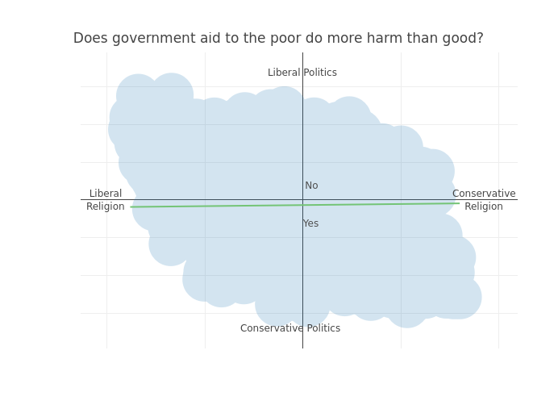



This recent election season exposed deep divides within Christians from different denominations. We still don't have good data on exactly how Christians voted--exit polls are not reliable or useful for this question--but it is clear that there are substantial differences among Christians of different ages, churches and ethnicities. In particular, a lot of attention in the media centered on U.S. evangelical Christians, a very broad term that nonetheless is a good predictor of how people vote in elections.

I wanted to look more concretely at the question of what an evangelical Christian is. Instead of defining the term by what an evangelical Christian should be, I examined the question from the perspective of what American say about themselves. The best data source for this question are the Pew surveys on religion and politics, the most recent of which was [just released](http://www.pewforum.org/religious-landscape-study/). Although the survey dates from 2014, it is the best available evidence because it used a very large sample--over 30,000 respondents--and contained a battery of questions concerning both religious and political views. For that reason, it is ideal for understanding what it means to be evangelical.

There are different ways of slicing and dicing this survey. We could, for example, take the question from the survey that asks people if they are evangelical Christians, and then restrict our focus to only this group. However, the evangelical label has been stretched and challenged by so many people that it seems it can describe people with remarkably contrasting beliefs.

[^1]: I used the R package mirt to estimate a 2PL item-response theory model. The full code is available in the code folder of our website's Github at <http://www.github.com/saudiwin/saudiwin.github.io>. The model includes sampling weights to account for the sampling design.

Instead, I used a statistical model[^1] to collapse the survey's questions down to two dimensions. I didn't know ahead of time what dimensions these would be, although I suspected that it would collapse to a left-right political scale and a conservative-liberal theology scale. The data analysis largely confirms my prior suspicions. The table below shows the three questions that best explained each of the two dimensions:

Dimension 1|Dimension 2
:-----------------------------------------------:|:--------------------------------------------:
Do you believe in God or a universal spirit?   |       Do you prefer small or big government?
How important is religion in your life?         |      Does government aid to the poor do more harm than good?
Is the Bible the Word of God?                    |     Are you conservative/moderate/liberal?
Should homosexuality be accepted by society?      |    Should homosexuality be accepted by society?

I decided to label the first dimension as religious belief and the second dimension as political opinions. The first appears to measure the difference between secular-liberal and conservative religious beliefs, such as whether a person believes in God and believes that the Bible is the Word of God. The top question for the second dimension reflects a fundamental divide between the political left and the political right: the size of government. Similarly, the second-most divisive political question concerns a perennial debate over the welfare state and whether the government should be involved. What is interesting to note is that the question about homosexuality discriminates on *both* dimensions. Knowing someone's views about homosexuality communicates information about both their religious and political beliefs, so we will certainly examine this question to understand how it fits in the picture.

The plot below shows respondents plotted along these dimensions. We can see from the general shape of the points that there is an oblong, Milky Way galaxy-type shape. This is because people tend to cluster in the top left, liberal religion and liberal politics, and on the bottom right, which is conservative religion and conservative politics. However, there are people who mix and match these beliefs, as they fall into the other two cells. People who are at the exact center are very difficult to classify using either dimension. These are the special cupcakes in the population: they don't conform to our simplistic analysis of religion and politics. But for a large number of Americans, these two dimensions do tell us a lot.

{::comment}

{:/comment}



We can use the other questions in the survey to analyze how people differ along their demographic background and political opinions, including religious denominations, age, income, government policies, and theological perspectives.

First of all, we can look at the list of religious groups to see how they all stack up against each other. We use a question from the survey that tracked a considerable number of religious categories so that we can look at evangelical Christians compared others. We plot each of these categories on our chart to see how they stand relative to all the respondents. The chart below shows the scores on the first dimensions, religious belief, for several different denominations and religious categories.

{::comment}

{:/comment}



This plot should be interpreted with caution because it is using a limited number of questions to differentiate respondents along basic beliefs, such as belief in God and whether God's word is inspired. However, it is still interesting that Evangelical Protestants are closer to Muslims than they are to Mainline Protestants or even Jewish people. This graph does seem to capture some intuitive idea about how close and far different religious groups are, at least when it comes to belief in God and the relative proximity between religious groups. As the Catholic philosopher Peter Kreeft once joked,

> I often find more mutual understanding between myself and a fundamentalist Southern Baptist who sincerely believes I am worshipping the great whore of Babylon and on my way to Hell, or with a Muslim who uncompromisingly rejects my belief that Christ is Lord as utter pagan blasphemy, than I find with some active Catholic laity, nuns, especially ex-nuns, priests and even bishops!

These differences reflect a more cultural understanding of faith than they do deep issues of doctrine.

In addition to religious beliefs, these self-reported affiliations tend to differ along political lines as well. We see below that many of the same patterns from religious affiliation are reproduced--nones and evangelicals are on opposite sides of the spectrum--but other religious grousp have moved. Mainline protestants are much farther from evangelicals on the political spectrum than on the religious spectrum, while Muslim-Americans are closer to evangelicals in politics than in religion. This finding makes sense when we consider that Muslims may agree with evangelicals on certain divisive topics, such as the place of homosexuality in society and abortion.

{::comment}

{:/comment}



Next we look at demographic factors. First, do people of varying incomes tend to cluster in certain categories? The chart below shows that income does not vary much along religious beliefs (the horizontal dimension), but rather mostly along the vertical dimension, political opinion. Again, this finding is not surprising given that wealthier people in the United States tend to be more conservative. It should be noted too, that these lines are just estimates--it is most likely that people in these income categories will fall in between these lines, but you can find plenty of respondents on the plot that don't fall into these neat buckets. What it does tell us is that, regardless of religious belief, wealthier people are more conservative. On the other hand, we don't know whether a wealthy person is necessarily more or less conservative when it comes to religion: there are both conservative and liberal wealthy believers.

{::comment}

{:/comment}



To see the uncertainy in these estimates, I'll show the points again, except that this time I'll color the points by whether or not the respondent makes more than $150,000. Darker colors indicate higher concentrations of wealthy respondents. We see in this chart that there is a clump of dark red in the upper-left corner corresponding to the liberal religion/liberal politics group, but that the clump in the bottom-right corner of conservative religion/conservative politics is much darker. In other words, there are wealthy respondents who are liberal politically, but there is a significantly larger group on the conservative end of the spectrum. This chart primarily serves to show how the lines reflect trends, not absolutes. Some people with high income will be politically liberal even if the majority of wealthy people are conservative.

{::comment}

{:/comment}



Next we'll look at education. This chart shows that the effect education is very different from income--while income tells us how politically conservative or liberal someone is, education is much more likely to tell us how conservative or liberal their religion is. It is also interesting to note that people with a high school education or less are very different than those who have at least some college or more schooling. Those with less than a college education are much more likely to be conservative on their religious views--although this difference doesn't tell us much about their politics.

{::comment}

{:/comment}



Given these two differing effects of income and education, we can learn something by putting the lines onto the same plot, making a cross-hatch. (Yes, I am literally putting people in boxes). Now we have a bunch of pick-up sticks laid on top of our chart. While it is a bit too much to absorb, it shows how income and education have a complicated interaction when it comes to people's religious and political beliefs. To give just one interesting interpretation, there is a big box of people who have a very high income (more than $150K) but low education (high school or less). These people tend to have very conservative politics and their religious beliefs are also more conservative. On the flip side, the box with people with low income and high education shows that they are more liberal politically and they tend to have more liberal faith. In other words, people are complicated, and we can't always know people's beliefs just by knowing either their education or their income.

{::comment}

{:/comment}



Now we're going to dig deep into how people identify in terms of religion and what that says about their politics. First, we'll look at responses to the question, "How often do you share your faith with non-believers or people from other religious backgrounds?" We see that this question generally corresponds to what we know of religious belief: those who share their faith "once or twice a month or more" tend to also have more conservative beliefs. In addition, there is a slight leftward tilt to the lines, which implies that these people also tend to be more *liberal* politically. It's not a very strong relationship, but it is there, and it is quite interesting. Essentially, it means that people who share their faith a lot are in general more conservative in their religious beliefs. But when we look at people who are equally conservative in religious belief, those who share their faith are also more liberal (or moderate) politically.

{::comment}

{:/comment}



Another important part of faith is praying. The chart below shows the predicted lines for a question that asks respondents how often they pray. Again, we see that praying is a good indicator of whether someone is more conservative religiously. We also see the same, even slighter, leftward tilt, implying that regardless of belief, people who pray a lot will tilt (ever so slightly) liberal politically. One additional note is that the "Never" category is way out to the left on religious belief. This happened because there are only a few people who never pray in America--this survey estimates it at about 1 in 10 Americans--so the model pushed them way outside the normal boundaries. This is a case where the model isn't quite as accurate as it could be because of the small number of people in this particular category.

{::comment}

{:/comment}



Finally, let's look at how often people attend church (or place of worship), which is also a core component of all religions. These lines show an even more pronounced leftward tilt. This chart means that people who attend church are much more likely to be more conservative in their religious beliefs, but at the same time their political opinions are more liberal than fellow believers who don't attend church.

{::comment}

{:/comment}



Now that we've diagnosed the very interesting relationship between religious belief and religious practice, we can look at divisive political and religious questions that were asked of respondents. First, we'll use a question that measures the exclusivity of people's religious commitments. This question asked, "is your religion the one, true faith leading to eternal life, or can many religions lead to eternal life?" We only put one line on the chart below because this is a simple yes/no question. Those to the right of the line said that their religion is exclusive, while those to the left said that many religions can lead to eternal life. This question does not tell us much, if anything, about someone's political views, but it does clearly delineate those who are very conservative in their religious beliefs from those who aren't.

{::comment}

{:/comment}



We first look at the question on homosexuality, which we know is very divisive on both dimensions. This question asked respondents, "should homosexuality be accepted by society?" Unlike religious practice, this question has a strong rightward tilt. This means that those who think homosexuality should be discouraged are more likely to be conservative politically and religiously. This question would appear to exemplify the divide between the groups that match conservative religious beliefs to conservative politics and vice versa. This line cuts the Milky Way galaxy of survey respondents neatly in half. We can also see that there are in general more respondents on the accept homosexuality side than the discourage homosexuality side.

{::comment}

{:/comment}



While homosexuality is a social question with clear religious and political connotations, we can look at whether other political questions are similarly divisive along religious lines. The question below asks respondents whether they think government aid to the poor does more harm than good. The slant on this line is very different--it is nearly completely horizontal. This means that government welfare policy is not an issue that breaks along religious lines. It does divide conservatives and liberals in terms of politics, but it doesn't reflect an underlying religious divide as well. People who have conservative and liberal faith fall on both sides of the question.

{::comment}

{:/comment}



Next we'll examine environmental policy. This question asked respondents whether stricter environmental regulations are worth the added cost. This question is similar to the homosexuality question because it breaks down along political and religious lines. People who think environmental regulations are more important tend to be more liberal both politically and religously, although the relationship is stronger for their political ideology than for their faith.

{::comment}

{:/comment}



Based on our analysis so far, we know that core political questions, such as welfare, environmental regulations, and homosexuality can all divide people on both religious and political grounds. The strongest divide is on homosexuality. However, we also find that there is a difference between religious belief and religious practice. People who are similarly conservative in religious belief differ in their political views depending on how much they practice their faith. Those who practice their faith more tend to be slightly more liberal politically as well.

We'll put up one last question from our survey. We know from the polls during the election that there was a divide between younger and older evangelicals over political candidates--generally speaking, older evangelicals preferred Trump, while younger evangelicals were much more likely to prefer third-party candidates or Clinton. For this chart, we'll put up both the age categories and a vertical line that shows where evangelicals are on the religion spectrum. It does not show a pretty picture. People who are younger tend to be both more liberal politically and religiously. On the flip side, people who are evangelicals are very conservative in general in terms of their religious views, and even compared to people who share the same religious views but wouldn't choose the label evangelical, they are more conservative politically. In total, it seems that there is a looming split in the evangelical church between younger and older believers, with younger believers moving away from their older peers in both religious faith and political ideology.

{::comment}

{:/comment}



This was a preliminary analysis, and these conclusions aren't firm. But they do indicate the nature of politics and religion in America today, and the issues that divide us and unite us. Also, we shouldn't just think of religious identity as a list of questions but also as a list of practices. When we note that certain political issues tend to divide Americans on both religious and political grounds, we can't assume that all Americans are equally devoted to their religious traditions even if they believe them to be true. As is often the case, reality is more complicated than our limited perspectives allow it to be.

The potential conflict between younger and older evangelicals that our last chart illustrates is part of what motivates this web page. We want to offer a space for young evangelicals to hash out their political and religious differences in a setting that is non-confrontational, biblically-oriented, and open to any kind of controversial topic. In a sense, we don't want to just ask how Christians should vote, but rather we want to be Christians who do politics.
