

The term evangelical Christian pops up in the media constantly, in part because opinion polls often ask people whether they would describe themselves with that label. But this single question hides a lot of diversity around what is meant by evangelical Christian, especially when it comes to political views. As we are forming this website specifically on these issues, we wanted to look in-depth at how religious views and political opinions relate to each other for Christians and non-Christians.

The best available evidence on this question comes from the massive 36,000-respondent Pew survey on religion and politics, the most recent of which was [just released](http://www.pewforum.org/religious-landscape-study/). From analyzing this survey, I discovered that evangelical Christians, compared to other religious groups, are unified around some questions with religious dimensions, notably homosexuality. However, while evangelicals as a whole are more conservative politically, my analysis revealed that some evangelical respondents who practiced certain Christian behaviors, such as praying, sharing their faith, and attending church, were in fact more liberal/moderate politically than other people with similar conservative religious views. In addition, younger and more educated people tended to be more liberal politically regardless of their religious beliefs. While on the outside it might seem that evangelicals all share political opinions, on the inside there is considerable room for disagreement.

Evangelicals, at least as a label people use to describe themselves, are not a monolithic bloc. The table below shows responses to several questions about belief and practice for self-reported evangelicals. Only 60% of evangelicals attend a church at least once a month. Around 90% believe that the Bible is the Word of God, but only about 70% read the Bible at least once monthly. The only question on which evangelicals are unanimous (near 100 percent) is that they believe in God. While that last statistic is encouraging--there don't seem to be any evangelical atheists--in general it is difficult to use this label alone to describe American's views on religion and politics.

Question|Answer|Percentage
:--------------------------------:|:----------------:|:--------------------------------------------:
Do you believe in God?	          |  No	              | 0%
	          |  Yes	            |   100%
How often do you attend church?	  |  Less Than Weekly	| 40%
  |  Weekly	          | 60%
How often do you read Scripture?	|  Less Than Monthly |	 24%
	|  Monthly	         |  76%
Is the Bible the Word of God?	    |  No	               | 11%
    |  Yes	             |  89%

[^1]: I used the R package mirt to estimate a 2PL item-response theory model. The full code is available in the code folder of our website's Github at <http://www.github.com/saudiwin/saudiwin.github.io>. The model includes sampling weights to account for the sampling design.

[^2]: These lines are known in the IRT literature as either equiprobability contours or cutting planes. They show the point at which a respondent is at least 50% likely to be in the associated category based on their scores on the religious and political dimensions.

For that reason, I chose to look at all religious groups present in the Pew Survey, while still trying to focus specifically on the relationship between religion and political opinions. We could focus only on evangelicals' responses to the fifty-plus questions in the survey, but that level of detail would make it hard to generalize. On the other hand, we don't want to just limit ourselves to just a few questions, because then we will potentially miss important dimensions of how American Christians view religion & politics.

 Rather, what I wanted to do was to form one index of religious belief, and one index of political opinion, and then look at how these two dimensions relate to each other. Fortunately, there is a statistical method[^1] which is able to accomplish this for me without having to decide which questions belong in which index. All I had to do was tell the model that I wanted to compare respondents along two different dimensions, and it found two clusters of questions that tended to divide people along two dimensions. While I couldn't tell the model that I wanted religion & politics as the dimensions, that is in fact what it found. The table below shows those questions which the model believed were most important for each of the two dimensions it found in the data:

Dimension 1|Dimension 2
:-----------------------------------------------:|:--------------------------------------------:
Do you believe in God or a universal spirit?   |       Do you prefer small or big government?
How important is religion in your life?         |      Does government aid to the poor do more harm than good?
Is the Bible the Word of God?                    |     Are you conservative/moderate/liberal?
Should homosexuality be accepted by society?      |    Should homosexuality be accepted by society?

As can be seen, the first dimension reflects certain core religious questions, such as whether someone believes in God and whether they believe the Bible is the Word of God. The second picks up political concerns related to the size of government, welfare, and political ideology. Interestingly, both dimensions share homosexuality as an important question. In other words, views on homosexuality affect people's political and religious beliefs.

In order to use these dimensions, we need to put labels on them to know what each end of the scale refers to. For the political dimension, it is relatively easy as we can say that people tend to be liberal or conservative, with moderates in the middle. For religion, it is far more difficult, especially because we do not have questions about specific kinds of doctrine that separate believers, such as views on baptism or predestination. Furthermore, the survey includes non-Christians as well as Christians. The terms I chose for this dimension are "traditional", for those with traditional Judeo-Christian views, such as conservative Christians but also Muslims and conservative Jews. The other end of the spectrum is "progressive", which reflects people who want to modify, reject or otherwise alter traditional religious belief. People who are Christians but would not accept conservative doctrine would fall on the more progressive side, while people who identify as having no religious belief would be even more "progressive". These labels are not perfect, and other ones could be constructed, but I think that they help identify some of the social differences in political and religious beliefs.

The plot below shows respondents plotted along these dimensions. We can see from the general shape of the points that there is an oblong, Milky Way galaxy-type shape. This is because people tend to cluster in the top left, progressive religion and liberal politics, and on the bottom right, which is traditional religion and conservative politics. However, there are people who mix and match these beliefs, as they fall into the other two cells. People who are at the exact center are very difficult to classify using either dimension. These are the special cupcakes in the population: they don't conform to our simplistic analysis of religion and politics that uses only two dimensions. But for a large number of Americans, these two dimensions do tell us a lot.

{::comment}
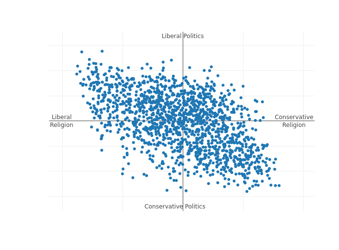
{:/comment}



We can use the other questions in the survey to analyze how people differ along their demographic background and political opinions, including religious denominations, age, income, government policies, and theological perspectives.

First of all, we can look at the list of all religious categories--Christians and non-Christians--to see how they all stack up against each other. We plot each of these categories on our chart to see how they stand relative to all the respondents. The chart below shows the scores on the first dimensions, religious belief, for several different denominations and religious categories. The "none" category represents those who said they had no religious affiliation (although not necessarily implying they do not have any religious/spiritual beliefs).

{::comment}
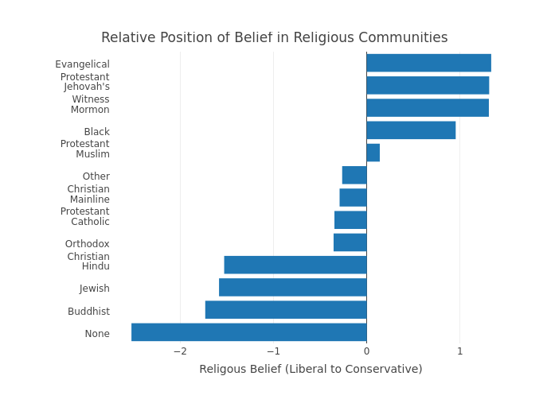
{:/comment}



This plot should be interpreted with caution because it is using a limited number of questions to differentiate respondents along basic beliefs, such as belief in God and whether God's word is inspired. However, it is still interesting that Evangelical Protestants are closer to Muslims than they are to Mainline Protestants or even Jewish people. This graph does seem to capture some intuitive idea about how close and far different religious groups are, at least when it comes to basic distinctions in progressive versus traditional belief. Of course there are differences within these groups--such as between progressive and traditional Jews--that are masked by looking only at aggregates. As the Catholic philosopher Peter Kreeft once joked,

> I often find more mutual understanding between myself and a fundamentalist Southern Baptist who sincerely believes I am worshipping the great whore of Babylon and on my way to Hell, or with a Muslim who uncompromisingly rejects my belief that Christ is Lord as utter pagan blasphemy, than I find with some active Catholic laity, nuns, especially ex-nuns, priests and even bishops!

These self-reported religious groups tend to differ along political lines as well. The plot below shows the scores along the political dimension for each religious category. We see that many of the same patterns from religious affiliation are reproduced--nones and evangelicals are on opposite sides of the spectrum--but the relationship is much weaker. While religious differences run the entire length of the scale for the religious dimension, from -2 to +2, political differences are only about one-tenth as large, ranging from -0.2 to +0.2. The numbers are somewhat arbitrary, but they do give a sense of the scale of difference between respondents.

{::comment}
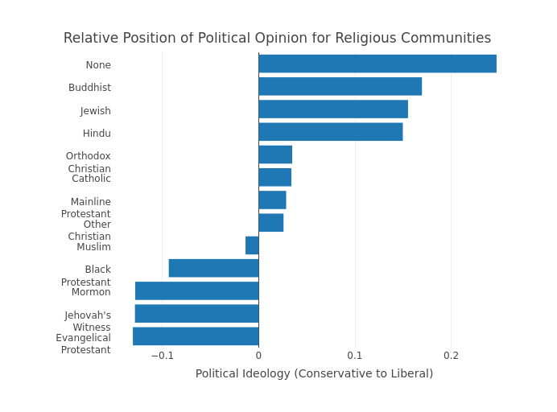
{:/comment}



We can use these two dimensions to understand how demographic factors and religious/political opinions divide people. First, do people of varying incomes tend to be more traditional/progressive/conservative/liberal? Answering this question is not straightforward, especially as we want to know how income clusters respondents along both dimensions, religion and politics. The best way is to plot each income category as a line[^2] on top of the respondents so that we can see how income divides our respondents along religion and politics into groups defined by their income. Each line shows the point at which people with that amount of income are most likely to fall on the chart. The direction of the line tells you how each demographic category divides people. Horizontal lines divide people along politics, while vertical lines divide people along religion. Slanted lines do some of both.

The chart below shows that the income lines, which are almost perfectly horizontal, do not divide the survey respondents along religious beliefs, but rather mostly along political opinion. Again, this finding is not surprising given that wealthier people in the United States tend to be more conservative politically. It should be noted too, that these lines are just estimates--it is most likely that people in these income categories will fall at these specific lines, but you can find plenty of respondents on the plot that don't fall into these neat buckets. What it does tell us is that, regardless of religious belief, wealthier people have more conservative political opinions. On the other hand, we don't know whether a wealthy person is necessarily more or less progressive in terms of religious belief: there are a significant number of wealthy traditionalists and progressives.

{::comment}
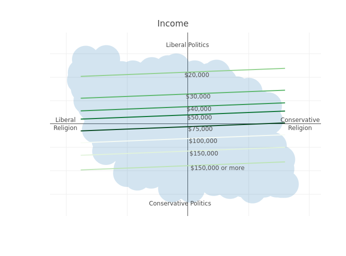
{:/comment}



To see the uncertainty in these estimates, I'll show the points again, except that this time I'll color the points by whether or not the respondent makes more than $150,000. Darker colors indicate higher concentrations of wealthy respondents. We see in this chart that there is a clump of dark red in the upper-left corner corresponding to the liberal religion/liberal politics group, but that the clump in the bottom-right corner of conservative religion/conservative politics is much darker. In other words, there are wealthy respondents who are liberal politically, but there is a significantly larger group on the conservative end of the spectrum. This chart primarily serves to show how the lines reflect trends, not absolutes. Some people with high income will be politically liberal even if the majority of wealthy people are conservative.

{::comment}
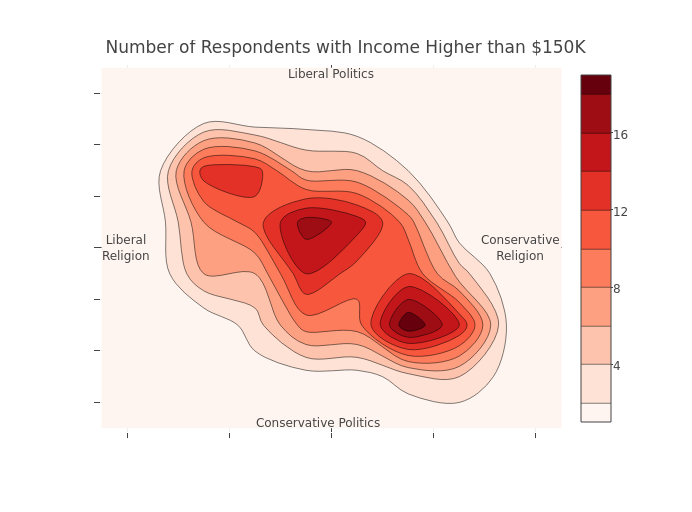
{:/comment}



Next we'll look at education. This chart shows that the effect of education is very different from income--while income tells us how politically conservative or liberal someone is, education is much more likely to tell us how progressive or traditional their religion is. It is also interesting to note that people with a high school education or less are very different than those who have at least some college or more schooling. Those with less than a college education are much more likely to be traditional on their religious views--although this difference doesn't tell us very much about their politics.

{::comment}
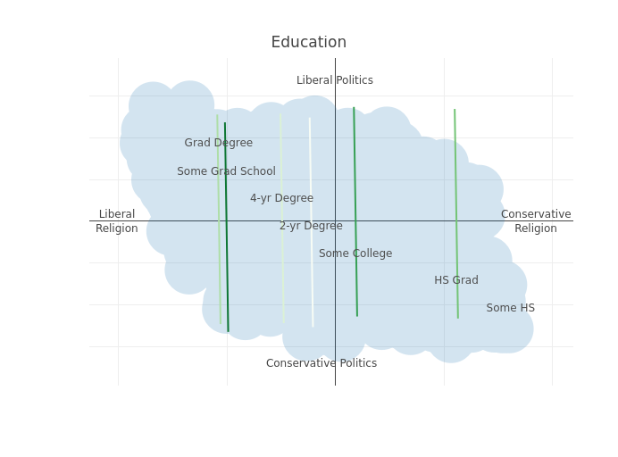
{:/comment}



Given these two differing effects of income and education, we can learn something by putting the lines onto the same plot, making a cross-hatch. (Yes, I am literally putting people in boxes). Now we have a bunch of pick-up sticks laid on top of our chart. While it is a bit too much to absorb, it shows how income and education have a complicated interaction when it comes to people's religious and political beliefs. To give just one interesting interpretation, there is a big box of people who have a very high income (more than $150K) but low education (high school or less). These people tend to have very conservative politics and their religious beliefs are very traditional. On the flip side, the box with people with low income and high education shows that they are more liberal politically and they tend to have more progressive faith.

{::comment}
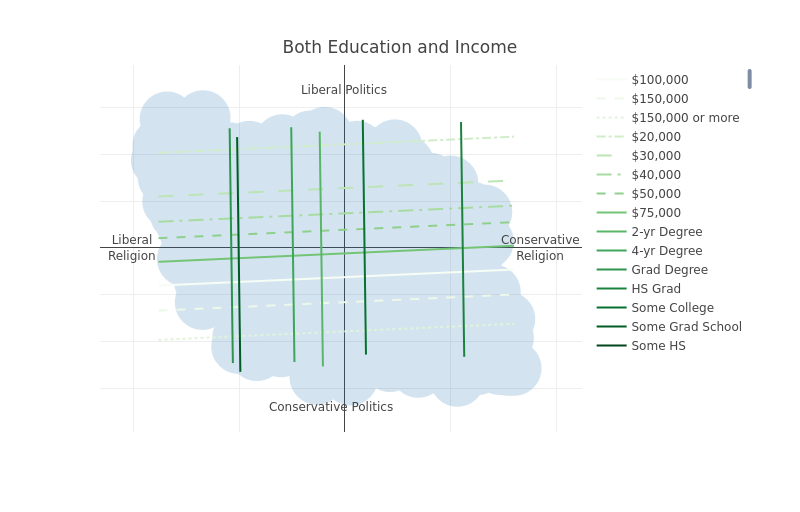
{:/comment}



Now we're going to dig deep into how people identify in terms of religion and what that says about their politics. First, we'll look at responses to the question, "How often do you share your faith with non-believers or people from other religious backgrounds?" We see that this question generally corresponds to what we know of religious belief: those who share their faith "once or twice a month or more" tend to also have more traditional beliefs. In addition, there is a slight leftward tilt to the lines, which implies that these people also tend to be more *liberal* politically. It's not a very strong relationship, but it is there, and it is quite interesting. Essentially, it means that people who share their faith a lot are in general more traditional in their religious beliefs. But when we look at people who are equally traditional in religious belief, those who share their faith are also more liberal (or moderate) politically.

{::comment}
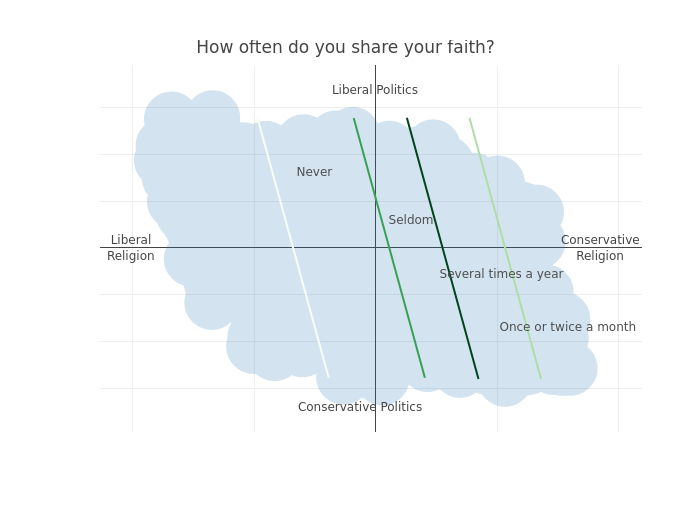
{:/comment}



Another important part of faith is praying. The chart below shows the predicted lines for a question that asks respondents how often they pray. Again, we see that praying is a good indicator of whether someone is more traditional religiously. We also see the same, even slighter, leftward tilt, implying that regardless of belief, people who pray a lot will tilt liberal politically.

{::comment}
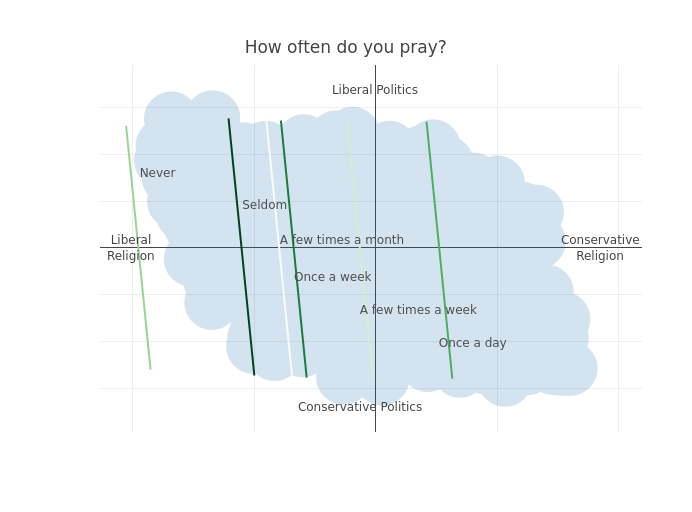
{:/comment}



Finally, let's look at how often people attend church (or place of worship), which is also a core component of all religions. These lines show an even more pronounced leftward tilt. This chart means that people who attend church are much more likely to be more traditional in their religious beliefs, but at the same time their political opinions are more liberal than fellow believers who don't attend church.

{::comment}
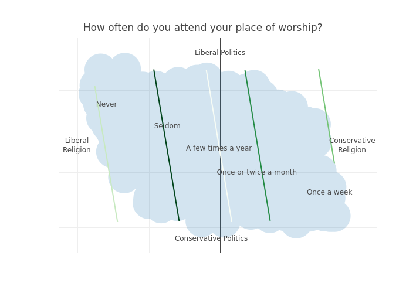
{:/comment}



Now that we've diagnosed the very interesting relationship between religious belief and religious practice, we can look at divisive political and religious questions that were asked of respondents. First, we'll use a question that measures the exclusivity of people's religious commitments. This question asked, "is your religion the one, true faith leading to eternal life, or can many religions lead to eternal life?" We only put one line on the chart below because this is a simple yes/no question. Those to the right of the line said that their religion is exclusive, while those to the left said that many religions can lead to eternal life. This question does not tell us much, if anything, about someone's political views, but it does clearly delineate those who are very traditional in their religious beliefs from those who aren't.

{::comment}
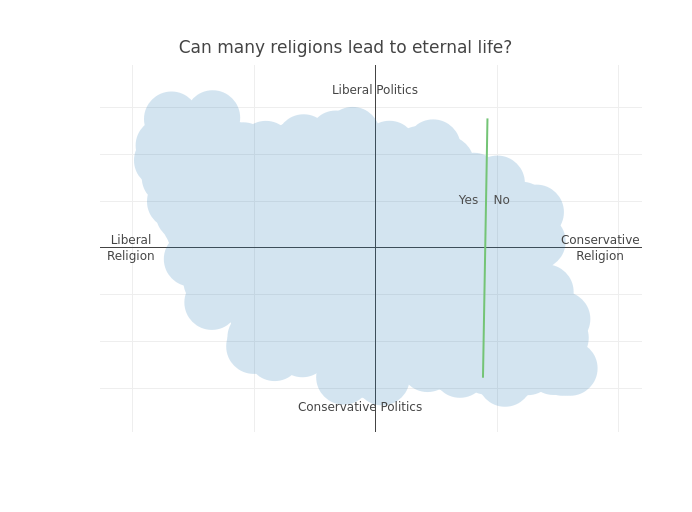
{:/comment}



We next look at the question on homosexuality, which we know is very divisive on both dimensions. This question asked respondents, "should homosexuality be accepted by society?" Unlike religious practice, this question has a strong rightward tilt. This means that those who think homosexuality should be discouraged are more likely to be conservative politically and traditional religiously. This question would appear to exemplify the divide between the groups that match traditional religious beliefs to conservative politics and vice versa. This line cuts the Milky Way galaxy of survey respondents neatly in half. We can also see that there are in general more respondents on the accept homosexuality side than the discourage homosexuality side.

{::comment}
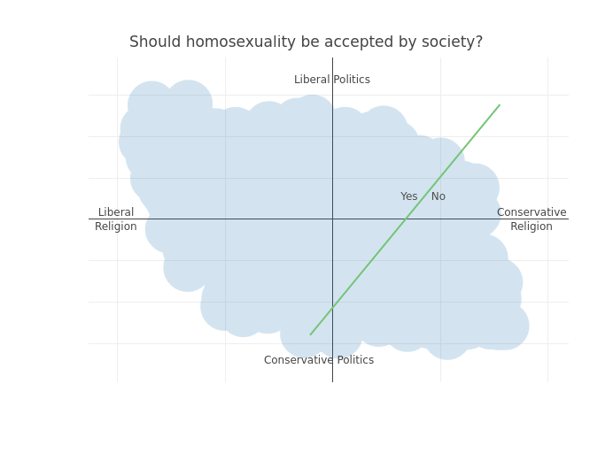
{:/comment}



Next we'll examine environmental policy. This question asked respondents whether stricter environmental regulations are worth the added cost. This question is similar to the homosexuality question because it breaks down along political and religious lines. People who think environmental regulations are more important tend to be more liberal politically and progressive in terms of religion, although the relationship is stronger for their political ideology than for their faith.

{::comment}
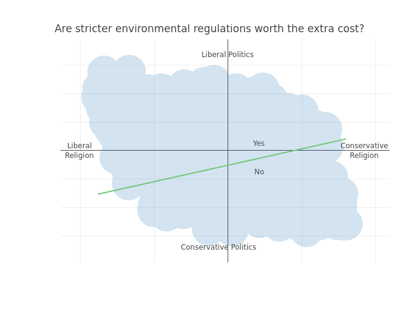
{:/comment}



Based on our analysis so far, we know that core political questions, such as welfare, environmental regulations, and homosexuality can all divide people on both religious and political grounds. The strongest divide along both dimensions is found on people's views on homosexuality. However, we also find that there is a difference between religious belief and religious practice. People who are similarly conservative in religious belief differ in their political views depending on how much they practice their faith. Those who practice their faith more tend to be more liberal/moderate.

We'll put up one last question from our survey. We know from the polls during the election that there was a divide between younger and older evangelicals over political candidates--generally speaking, older evangelicals preferred Trump, while younger evangelicals were much more likely to prefer third-party candidates or Clinton. For this chart, we'll put up both the age categories and we will color respondents by whether or not they are evangelicals. It does not show a pretty picture. People who are younger tend to be both more liberal politically and progressive religiously. On the flip side, people who are evangelicals are very traditional in general in terms of their religious views and also more conservative politically. In total, it seems that there is a looming split in the evangelical church between younger and older believers, with younger believers moving away from their older peers in both religious faith and political ideology.

{::comment}
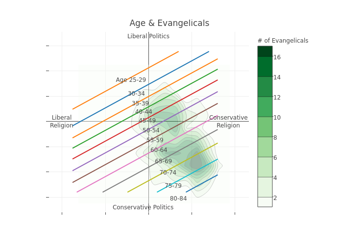
{:/comment}



This was an exploratory analysis, and these conclusions aren't firm. But they do indicate the nature of politics and religion in America today, and the issues that divide us and unite us. Also, we shouldn't just think of religious identity as a list of questions but also as a list of practices. There may be two kinds of evangelicals, those who attend church and those who don't, and their political beliefs may differ as a result. When we note that certain political issues tend to divide Americans on both religious and political grounds, we can't assume that all Americans are equally devoted to their religious traditions even if they believe them to be true. As is often the case, reality is more complicated than our limited perspectives allow it to be.

The potential conflict between younger and older evangelicals that our last chart illustrates is part of what motivates this web page. We want to offer a space for young evangelicals to hash out their political and religious differences in a setting that is non-confrontational, biblically-oriented, and open to any kind of controversial topic. We don't want to limit ourselves to asking who to vote for every four years.  Rather, we want to be Christians who follow Christ in a political world, wherever that takes us.
